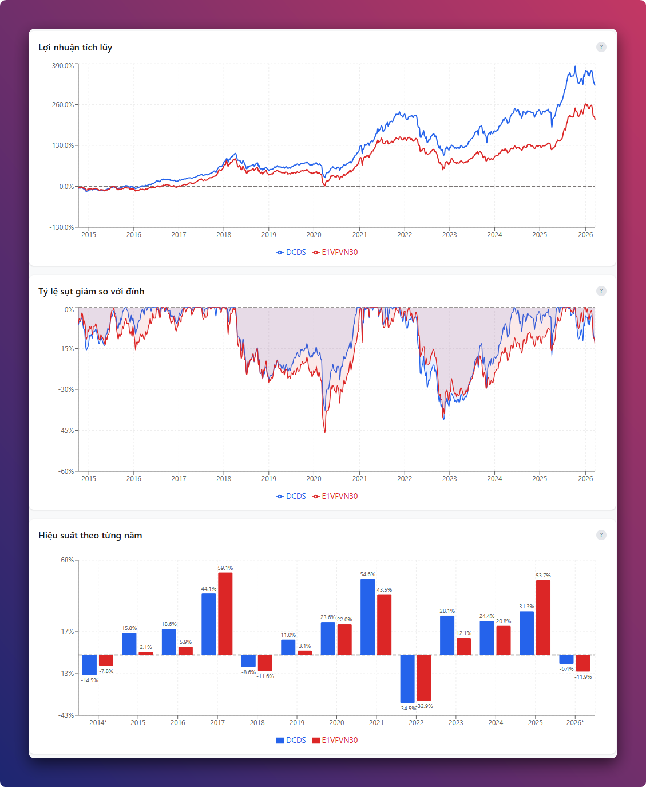
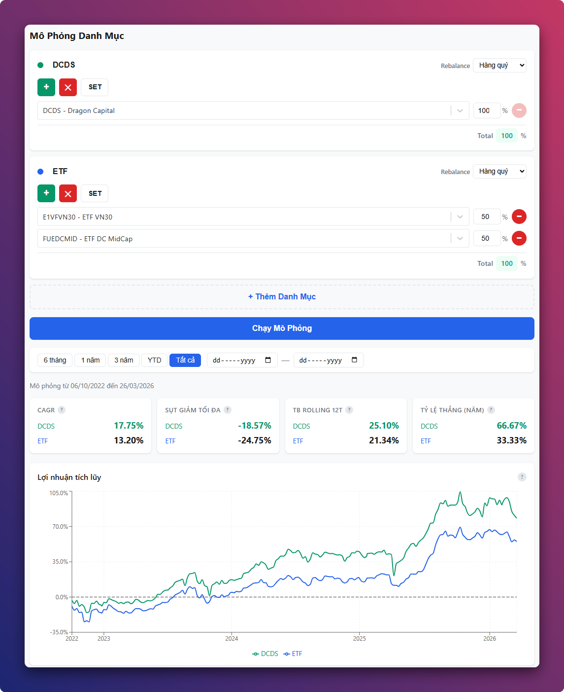
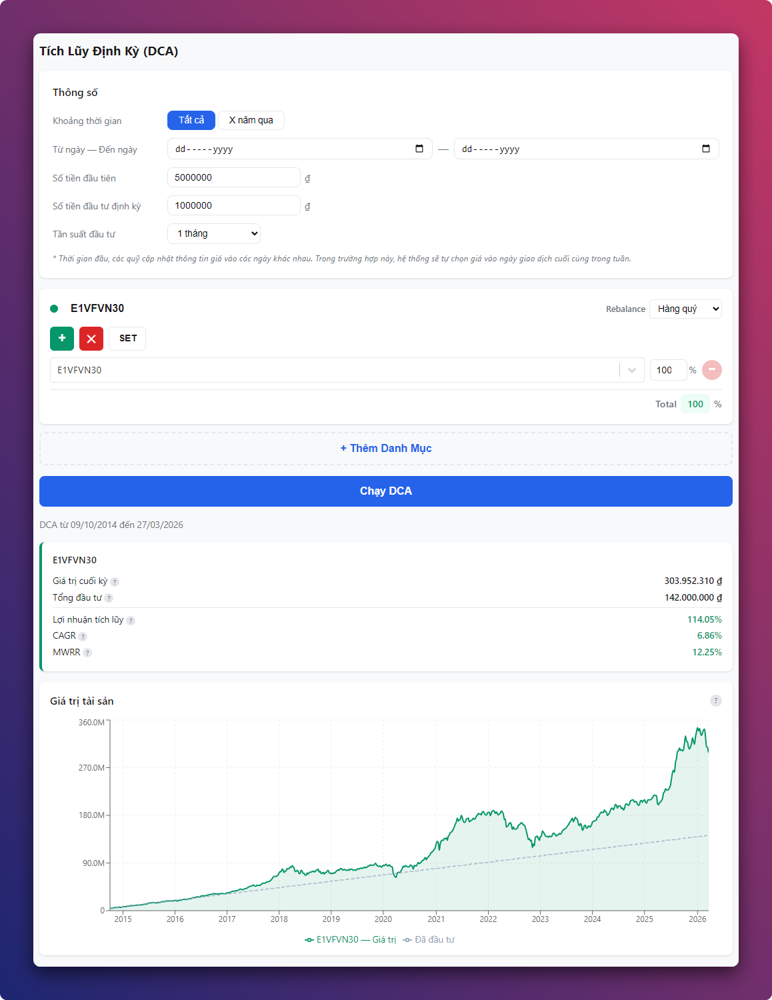
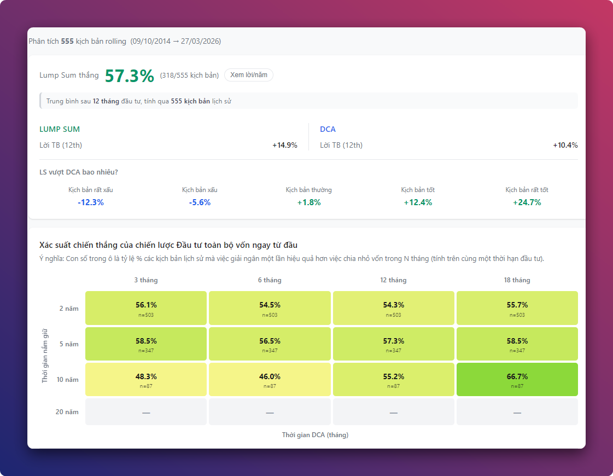

# So Sánh Quỹ Đầu Tư Việt Nam

Chào mọi người.

Mình ấp ủ ước mơ làm một cái dashboard để so sánh quỹ mở cổ phiếu với ETF tại Việt Nam từ lâu. Ban đầu code bằng R nhưng dashboard lại chạy rất chậm, tính toán lại lâu, không phù hợp để làm những chuyện này. Mà bản thân cũng không thể học code nên đành gác lại mọi thứ.

Nay nhờ sự giúp đỡ của Claude Code thì ước mơ này đã thành hiện thực.

Dashboard so sánh hiệu suất các quỹ đầu tư mở (cổ phiếu, trái phiếu, cân bằng) và ETF tại Việt Nam. Dữ liệu cập nhật tự động hàng ngày.

**Demo:** [fund.vohoanghac.com](https://fund.vohoanghac.com)

## Tính năng

### So Sánh quỹ
- Chọn quỹ để so sánh song song
- Chỉ số: CAGR, sụt giảm tối đa (max drawdown), rolling returns trung bình, tỷ lệ thắng theo năm
- Biểu đồ: lợi nhuận tích lũy, drawdown, lợi nhuận theo năm, rolling returns (6T–48T)
- Lọc theo khoảng thời gian: 6 tháng, 1 năm, 3 năm, YTD, tất cả, hoặc tùy chỉnh

### Mô Phỏng danh mục
- Tạo nhiều danh mục đầu tư với tỷ trọng tùy chỉnh
- Rebalance tự động theo quý hoặc theo năm

### Tích Lũy Định Kỳ (DCA)
- Mô phỏng đầu tư định kỳ (hàng tháng/hàng tuần) với số tiền cố định
- So sánh song song nhiều danh mục, hỗ trợ rebalance tự động
- Chỉ số: lợi nhuận tích lũy, CAGR, MWRR (Money-Weighted Rate of Return)
- Biểu đồ giá trị danh mục theo thời gian

### Lump Sum vs DCA
- So sánh hai chiến lược triển khai vốn: đầu tư một lần (Lump Sum) và rải đều định kỳ (DCA)
- Phân tích rolling trên toàn bộ lịch sử — mỗi ngày hợp lệ là một kịch bản độc lập
- Heatmap xác suất chiến thắng theo thời gian nắm giữ (2–20 năm) × thời gian DCA (3–18 tháng)
- Biểu đồ phân bố kết quả và 5 kịch bản percentile (rất xấu → rất tốt)

## Dữ liệu

**56 quỹ** (27 cổ phiếu + 19 trái phiếu + 5 cân bằng + 5 ETF), dữ liệu NAV lịch sử từ 2004.

### Quỹ cổ phiếu (27)

| Mã quỹ | Tên quỹ | Từ ngày |
|---------|---------|---------|
| DCDS | Quỹ Đầu Tư Chứng Khoán Năng Động DC | 2004 |
| BVFED | Quỹ Đầu Tư Cổ Phiếu Năng Động Bảo Việt | 2014 |
| DCDE | Quỹ Đầu Tư Cổ Phiếu Tập Trung Cổ Tức DC | 2014 |
| ENF | Quỹ Đầu Tư Năng Động Eastspring Investments Việt Nam | 2014 |
| MBVF | Quỹ Đầu Tư Giá Trị MB Capital | 2014 |
| VEOF | Quỹ Đầu Tư Cổ Phiếu Hưng Thịnh VinaCapital | 2014 |
| VCBFBCF | Quỹ Đầu Tư Cổ Phiếu Hàng Đầu VCBF | 2014 |
| SSISCA | Quỹ Đầu Tư Lợi Thế Cạnh Tranh Bền Vững SSI | 2014 |
| MAFEQI | Quỹ Đầu Tư Cổ Phiếu Manulife | 2014 |
| BVPF | Quỹ Đầu Tư Cổ Phiếu Triển Vọng Bảo Việt | 2017 |
| VESAF | Quỹ Đầu Tư Cổ Phiếu Tiếp Cận Thị Trường VinaCapital | 2017 |
| VNDAF | Quỹ Đầu Tư Chủ Động VND | 2018 |
| DCAF | Quỹ Đầu Tư Tăng Trưởng DFVN | 2019 |
| MAGEF | Quỹ Đầu Tư Cổ Phiếu Tăng Trưởng Mirae Asset Việt Nam | 2019 |
| VCBFMGF | Quỹ Đầu Tư Cổ Phiếu Tăng Trưởng VCBF | 2021 |
| TBLF | Quỹ Đầu Tư Cổ Phiếu Tăng Trưởng Ballad Việt Nam | 2021 |
| VLGF | Quỹ Đầu Tư Tăng Trưởng Dài Hạn Việt Nam | 2021 |
| NTPPF | Quỹ Đầu Tư Cổ Phiếu Triển Vọng NTP | 2022 |
| PHVSF | Quỹ Đầu Tư Chọn Lọc Phú Hưng Việt Nam | 2022 |
| UVEEF | Quỹ Đầu Tư Cổ Phiếu United ESG Việt Nam | 2022 |
| BMFF | Quỹ Đầu Tư Tăng Trưởng Bordier - MB Flagship | 2023 |
| VMEEF | Quỹ Đầu Tư Cổ Phiếu Kinh Tế Hiện Đại VinaCapital | 2023 |
| VCAMDF | Quỹ Đầu Tư Bản Việt Discovery | 2024 |
| LHCDF | Quỹ Đầu Tư Năng Động Lighthouse | 2024 |
| VDEF | Quỹ Đầu Tư Cổ Phiếu Cổ Tức Năng Động VinaCapital | 2024 |
| TCGF | Quỹ Đầu Tư Tăng Trưởng Thành Công | 2024 |
| EVESG | Quỹ Đầu Tư Cổ Phiếu ESG Eastspring Investments Việt Nam | 2024 |

### Quỹ trái phiếu (19)

| Mã quỹ | Tên quỹ | Từ ngày |
|---------|---------|---------|
| VFF | Quỹ Đầu Tư Trái Phiếu Bảo Thịnh VinaCapital | 2013 |
| DCBF | Quỹ Đầu Tư Trái Phiếu DC | 2013 |
| BVBF | Quỹ Đầu Tư Trái Phiếu Bảo Việt | 2016 |
| SSIBF | Quỹ Đầu Tư Trái Phiếu SSI | 2017 |
| DCIP | Quỹ Đầu Tư Trái Phiếu Gia Tăng Thu Nhập Cố Định DC | 2019 |
| VNDBF | Quỹ Đầu Tư Trái Phiếu VND | 2019 |
| VCBFFIF | Quỹ Đầu Tư Trái Phiếu VCBF | 2019 |
| PVBF | Quỹ Đầu Tư Trái Phiếu PVCOM | 2020 |
| MBBOND | Quỹ Đầu Tư Trái Phiếu MB | 2020 |
| ABBF | Quỹ Đầu Tư Trái Phiếu An Bình | 2020 |
| DFIX | Quỹ Đầu Tư Trái Phiếu DFVN | 2021 |
| ASBF | Quỹ Đầu Tư Trái Phiếu An Toàn Amber | 2021 |
| VLBF | Quỹ Đầu Tư Trái Phiếu Thanh Khoản VinaCapital | 2021 |
| MAFF | Quỹ Đầu Tư Trái Phiếu Linh Hoạt Mirae Asset Việt Nam | 2021 |
| LHBF | Quỹ Đầu Tư Trái Phiếu Lighthouse | 2022 |
| HDBOND | Quỹ Đầu Tư Trái Phiếu Lợi Tức Cao HD | 2022 |
| VCAMFI | Quỹ Đầu Tư Trái Phiếu Bản Việt | 2022 |
| VNDCF | Quỹ Đầu Tư Trái Phiếu Linh Hoạt VND | 2023 |
| MBAM | Quỹ Đầu Tư Trái Phiếu Dòng Tiền Linh Hoạt MB | 2024 |

### Quỹ cân bằng (5)

| Mã quỹ | Tên quỹ | Từ ngày |
|---------|---------|---------|
| VCBFTBF | Quỹ Đầu Tư Cân Bằng Chiến Lược VCBF | 2013 |
| VCAMBF | Quỹ Đầu Tư Cân Bằng Bản Việt | 2014 |
| MAFBAL | Quỹ Đầu Tư Cân Bằng Manulife | 2017 |
| VIBF | Quỹ Đầu Tư Cân Bằng Tuệ Sáng VinaCapital | 2019 |
| MDI | Quỹ Đầu Tư Năng Động Manulife | 2024 |

### ETF (5)

| Mã quỹ | Từ ngày |
|---------|---------|
| E1VFVN30 | 2014 |
| FUEVFVND | 2020 |
| FUEDCMID | 2022 |
| FUESSVFL | 2020 |
| FUEVN100 | 2020 |

### Nguồn dữ liệu
- **Quỹ mở:** [fmarket.vn](https://fmarket.vn) API
- **ETF:** [vnstock](https://github.com/thinh-vu/vnstock) (nguồn VCI)
- **Cập nhật:** GitHub Actions chạy tự động 18:00 (giờ VN), thứ 2–6
